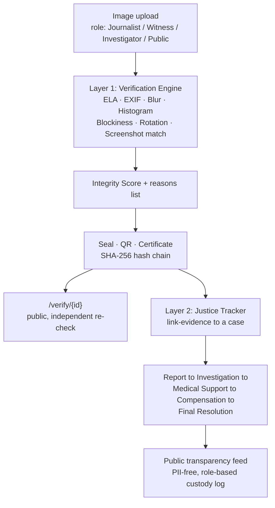

<div align="center">

# 🔴🟡 ShottoQR | সত্যQR
### *Sealed Truth for an Unforgettable July*

**A forensic verification engine, a justice tracker, and a living memorial. Built for the survivors, journalists, and citizens of the July 2024 uprising, and for every movement that comes after it.**

[](#)
[](#-layer-1--সত্য-যাচাই-verification-engine)
[](#-layer-2--ন্যায়বিচার-justice-tracker)
[](#)
[](https://YOUR-USERNAME.github.io/YOUR-REPO/)
[](#-license)

**[▶ Live Demo](#) · [📖 API Docs](#-api-reference) · [🖥️ Admin Panel](#-admin-panel) · [🎬 Pitch Page (GitHub Pages)](https://YOUR-USERNAME.github.io/YOUR-REPO/)**

</div>

---

## ✊ The Problem

In July 2024, Bangladesh lived through a month that changed the country. Almost immediately, the record of it became a battlefield. Photos were cropped to hide context. Injuries were staged or denied. Screenshots were doctored and re-shared as proof. Victims' families were asked to prove their own tragedy with no tools to do so, and no neutral system existed to separate a real photograph of harm from a manipulated one, or to track what happened to a case after it was reported.

**ShottoQR (সত্যQR, "Truth QR")** exists to close that gap. It is a forensic evidence pipeline that tells you how trustworthy an image is and why, a transparent case tracking system that follows a victim's journey from report to resolution without ever exposing their identity, and a living, bilingual archive so July 2024 is remembered with facts attached to it, not just feeling.

This isn't a hypothetical. It's a working system with 7 real forensic signals, a SHA-256 hash chained seal, QR verifiable certificates, a public transparency portal, an admin review workflow, and a role based (never name based) chain of custody log. All tested end to end.

---

## 🎬 See It Live

**Pitch page:** the full bilingual, animated identity built for this project lives at **[YOUR-USERNAME.github.io/YOUR-REPO](https://YOUR-USERNAME.github.io/YOUR-REPO/)**, served straight from this repo's `/docs` folder via GitHub Pages. No install needed, judges can open it on a phone.

**Product demo:**


*(record this yourself, see below, GitHub can't render a live product from a README)*

<details>
<summary><strong>How to enable the GitHub Pages link above</strong></summary>

1. Push this repo to GitHub, with `docs/index.html` included (already set up in this repo).
2. Go to **Settings → Pages** on the repo.
3. Under **Build and deployment**, set **Source: Deploy from a branch**, **Branch: main**, **Folder: /docs**. Save.
4. GitHub gives you a URL like `https://your-username.github.io/your-repo/` within a minute or two.
5. Replace every `YOUR-USERNAME.github.io/YOUR-REPO` in this README with that real URL.

</details>

<details>
<summary><strong>How to record the demo GIF</strong></summary>

1. Run the app locally (`uvicorn app.main:app --reload`) and open `http://localhost:8000/`.
2. Screen-record a 20 to 40 second walkthrough: upload an image, watch the Integrity Score appear, open the certificate/QR, then flip the language toggle. Free tools: **ScreenToGif** (Windows), **Kap** (Mac), **Peek** (Linux), or any screen recorder plus `ffmpeg`.
3. If you recorded an `.mp4`, convert it to a GIF and shrink it so it loads fast on GitHub:
   ```bash
   ffmpeg -i demo.mp4 -vf "fps=12,scale=800:-1:flags=lanczos" -loop 0 demo.gif
   ```
4. Save the file as `assets/demo.gif` in this repo. It renders automatically wherever `` appears in this README, no extra setup.

</details>

---

## 🧩 What It Does

### 🔍 Layer 1: সত্য যাচাই (Verification Engine)

* **7 signal forensic analysis.** ELA, EXIF metadata check, blur/sharpness, histogram clipping, JPEG blockiness, rotation canvas fill detection, and screenshot resolution matching, combined into one Integrity Score with a visible, human readable reasons list. Never a black box fake/real verdict.
* **Reuse and duplicate detection.** Perceptual hashing (pHash) flags whether an uploaded image has circulated before, so recycled photos from other events can't be passed off as new evidence.
* **Tamper evident sealing.** Every verified image gets a SHA-256 seal recorded in an append only hash chain. Break one link and the whole chain fails verification, so a seal can't be quietly edited after the fact.
* **QR verifiable certificates.** A downloadable, watermarked certificate with a QR code that opens a live `/verify/{id}` page and re-checks the seal against the database in real time. Anyone, including a journalist or a fact checker with zero technical background, can scan and verify independently.
* **Chain of custody, without names.** Every action (Uploaded, Verified, Viewed, Linked to Case) is logged by role only: Journalist, Witness, Investigator, Admin, Public. There's a full accountability trail that can never be used to identify or endanger a source.

### ⚖️ Layer 2: ন্যায়বিচার (Justice Tracker)

* **Public transparency feed.** Every case moves through five visible stages: **Report → তদন্ত (Investigation) → চিকিৎসা (Medical Support) → ক্ষতিপূরণ (Compensation) → চূড়ান্ত সমাধান (Final Resolution)**. A victim's family, a journalist, or an oversight body can see exactly where a case stands, without needing to ask anyone for an update.
* **Anonymous public reporting.** Anyone can report an incident with zero identifying information required. It lands in an admin queue as private by default and only reaches the public feed after a human reviewer approves it.
* **Deliberate PII omission.** Victim name, NID, and phone number are not fields in the data model at all. Not hidden, not encrypted, simply never collected, because that kind of data needs an access controlled government system, not a hackathon database. `case_reference` is the only public safe lookup identifier.
* **Admin panel.** Full case lifecycle management: create cases, update status, approve or reject public reports, link sealed evidence to a case. Zero raw API calls needed for daily operation.

### 🕯️ জুলাই স্মৃতি (July Memorial)

* **Interactive Calendar.** A poster style 1 to 36 July grid. Click any date to see what happened that day.
* **Timeline.** Drag to scroll through the full 36 day arc, browsable by hand.
* **Verified Archive.** Searchable, filterable, sourced record of confirmed events (শহীদ, মোড়/turning point, হামলা, fall), so the memorial is built on citation, not just memory.
* **About Us.** The team behind it.

### 🌐 Site-wide

* **True bilingual support** (বাংলা ⇄ English), one click, everywhere. Not a translated subset. The entire interface including the memorial and admin tooling.
* **Dark red, gold, and black visual identity** carried consistently from the homepage to the certificates themselves, with a faint fist watermark, so a sealed certificate is recognizably this movement's, not a generic template.

---

## 🏆 Why This Should Win *(mapped to your judging rubric)*

Scored out of the 80% that isn't audience engagement, because a project should win on what it is, not how hard its team can campaign for likes.

| Criterion | Weight | How ShottoQR earns it |
|---|---|---|
| **Impact & relevance to track** | 25% | Solves a documented, active problem: contested visual evidence and untracked justice claims from a real national event, for three concrete user groups. Victims and families get anonymous reporting and status visibility. Journalists and investigators get independent verification and a custody trail. Government and oversight bodies get a structured case pipeline and a public accountability feed. It is squarely a human rights and civic tech project, not a repurposed generic app. |
| **Technical execution** | 20% | Not a mockup. 7 independently implemented forensic signals with measured, honestly reported score separation. A real SHA-256 hash chain seal, not just a hash column, a chain, verifiable end to end. A FastAPI backend with **13/13 endpoint checks passing**. A full Playwright tested frontend across desktop and mobile with zero console errors. An append only custody log. Every claim in this README is something the code actually does, including the parts that don't work yet (see [Known Limitations](#-known-limitations-built-to-be-trusted-not-oversold)). |
| **Innovation & originality** | 15% | The combination is the innovation. Forgery detection specifically tuned and honestly scoped to real world evidence photos from a civil movement, fused with a PII free justice pipeline and a role based (not identity based) custody log. Built for high risk civic contexts like protests, conflict documentation, and human rights reporting, where most existing forensic tools assume a low stakes user and most case tracking tools assume full identity capture. |
| **Feasibility & resilience** | 10% | Runs on SQLite with zero external services required for Layer 1 and 2. No GPU, no paid API keys, functional on a single low end machine or a free tier deploy (Render/Railway). The optional CNN forgery detection signal was deliberately dropped, not because it wasn't tried, but because GPU inference is a real deployment liability in low bandwidth, low power field conditions. A resilience decision, not a shortcut. |
| **Presentation & usability** | 10% | One homepage, no `/docs`-only demo. Verification, reporting, and the memorial all live in a single bilingual interface a non-technical judge, or a non-technical victim's family member, can use unassisted. Admin workflows require no raw API calls. See the [pitch page](./july-memorial.html) for the full visual identity. |

---

## 🇧🇩 Path to National Adoption

This section exists because the goal was never just to win a hackathon. It's to build something the government can actually run.

* **Privacy by design, not privacy by policy.** PII fields don't exist in the schema, so there's nothing to leak, subpoena unsafely, or misconfigure.
* **Auditable by default.** Every seal, every view, every status change is logged and independently re-verifiable via QR. This is exactly the property an oversight ministry, a UN fact-finding mission, or an international press body needs before trusting a domestic system's output.
* **Boring, resilient infrastructure.** SQLite to PostgreSQL is a one line connection string change when case volume demands it. The whole stack runs on commodity hardware, which matters in a country where field conditions and bandwidth aren't guaranteed.
* **Honest forensics.** The system tells you what it can and can't detect (see below) instead of pretending to be an infallible lie detector. That's the property a government or international body needs before staking legal or diplomatic weight on a verified badge.
* **Extendable to any future movement or disaster.** The July 2024 memorial is a configuration of the architecture (one `JULY` data array), not a hardcoded one-off. The same evidence sealing and case tracking core could be repointed at any future crisis needing verifiable public record.

---

## ⚠️ Known Limitations (built to be trusted, not oversold)

Read this section out loud to the judges. It is a strength, not a weakness. It's the difference between a demo that survives scrutiny and one that doesn't.

**Reliably detected:** Blur, Crop, Brightness change.
**Partially detected:** Screenshots. Exact resolution screen dumps are caught. A resized screenshot currently is not.
**Not yet reliably detected:** Rotation, Photoshop edits, JPEG recompression, contrast changes.

On rotation specifically: a corner uniformity check does catch rotate-and-expand edits (the tell-tale solid colour triangular fill left in the corners). This test set's rotation fakes were generated as in-place rotate-and-crop, with no canvas fill, so the signal is real and valid, it simply doesn't match how this particular sample set happens to have been built. That distinction matters, and we say so rather than implying the problem is solved.

A pretrained CNN forgery detection model was scoped and evaluated and deliberately not shipped. The added GPU and deployment risk wasn't worth it for the accuracy gain against a dataset the heuristic signals already covered well. Adding it is a documented, straightforward extension for a team with GPU infrastructure, not a gap we're hiding.

**The Integrity Score is decision support, not a verdict.** It ships with a visible reasons list so a human (a journalist, an investigator, a judge) makes the final call with evidence in front of them, not a black box.

---

## 🏗️ Architecture



**Stack:** FastAPI, SQLAlchemy, SQLite, vanilla JS/HTML/CSS frontend (bilingual I18N), Pillow forensics pipeline, `qrcode`, Playwright for testing.

GitHub renders the diagram above automatically since it's a fenced ```mermaid``` block, no image export needed.

---

## 🚀 Setup

```bash
pip install -r requirements.txt
# or: pip install -r requirements.txt --break-system-packages

# 1. Put dataset images in data/july/ (img0001.jpg ... img0030.jpg/png)
#    data/labels_fixed.xlsx is already included

python -m scripts.load_dataset     # Task 1: loads images + labels into shakkhi.db
python -m scripts.test_pipeline    # Task 2: runs all 7 forensic signals, prints score separation
python -m scripts.seal_all         # Task 3: seals every analyzed image with hash, QR, certificate

uvicorn app.main:app --reload      # Tasks 4 & 5: full backend + frontend
```

Then open **`http://localhost:8000/`**. The frontend is the homepage. Raw API docs stay available at **`/docs`**.

Outputs land in `static/ela/`, `static/qr/`, `static/certificates/`.

> **Demoing from Colab?** Colab can't hold a persistent public URL by default. Either run locally or on a VM and demo directly, expose port 8000 with ngrok, or point judges at a Render/Railway deploy of this repo. Set `PUBLIC_BASE_URL` before sealing new evidence so QR codes on certificates point at the live tunnel or deployment.
> ```python
> import os
> os.environ["PUBLIC_BASE_URL"] = "https://your-ngrok-url.ngrok-free.app"
> ```
> Already sealed certificates keep their original URL. Re-run `/api/verify` to reseal if the tunnel changes. Colab's disk wipes on disconnect, so export `shottoqr.db` between sessions if you want to keep demo data.

---

## 📡 API Reference

**Layer 1: Verification**

| Method | Endpoint | Purpose |
|---|---|---|
| `POST` | `/api/verify` | Upload jpg/png, get back Integrity Score, verdict, reasons, QR, certificate |
| `GET` | `/api/evidence` | List all sealed evidence |
| `GET` | `/api/evidence/{id}` | Single evidence record |
| `GET` | `/api/evidence/{id}/custody-log` | Full chain of custody timeline (JSON) |
| `GET` | `/api/verify-seal/{id}` | Independently re-verify a seal (what the QR hits) |

**Layer 2: Justice Tracker**

| Method | Endpoint | Purpose |
|---|---|---|
| `POST` | `/api/cases` | Create a case (`case_reference`, `location`, `incident_summary`, `is_public`) |
| `GET` | `/api/cases` | Public transparency feed (`is_public=1` only) |
| `GET` | `/api/cases/{id}` | Case detail and linked evidence |
| `PATCH` | `/api/cases/{id}/status` | Advance status: Report → Investigation → Medical Support → Compensation → Final Resolution |
| `POST` | `/api/cases/{id}/link-evidence` | Attach sealed evidence to a case |

All 13 endpoint checks tested end to end against real dataset images.

## 🖥️ Admin Panel

`/admin`: create and manage cases, update status, approve or reject pending public reports, link evidence. No raw API calls required for day to day operation.

## 🗂️ Project Structure

```
app/
├─ database.py       SQLAlchemy engine/session
├─ models.py          EvidenceImage + Case + custody_log tables
├─ forensics.py        7 forensic signals + combine_signals to Integrity Score
├─ seal.py              SHA-256 seal, hash-chain ledger, QR generation, certificates
└─ main.py                FastAPI app (Layer 1 + Layer 2 + admin + memorial)
scripts/
├─ load_dataset.py    Task 1
├─ test_pipeline.py    Task 2
└─ seal_all.py           Task 3
templates/index.html · static/css/style.css · static/js/main.js   Frontend + I18N + JULY archive data
docs/index.html       GitHub Pages source (copy of the pitch page, see "See It Live" above)
assets/demo.gif        Product walkthrough GIF embedded in this README
```

To add another judge facing language (Hindi, Arabic, French, whoever is on the panel), add one key to every entry in the `I18N` object in `static/js/main.js` and a matching button in `.lang-switch` in `templates/index.html`.

---

## 👥 Team

| Name | Institution | Role | GitHub |
|---|---|---|---|
| Meherun Ritu | ULAB | Team Lead | [@Meherunritu](https://github.com/Meherunritu) |
| Tahsin Shuborna | AUST | Engineering | [@tahscene](https://github.com/tahscene) |
| Shahriar Hossain Arafat | AUST | Engineering | [@ShArafat58](https://github.com/ShArafat58) |

---

## 📜 License

MIT. Built to be forked by the next team that needs to protect the record of what actually happened.

<div align="center">

**সত্য মুছে যায় না। The truth doesn't erase.**

</div>
