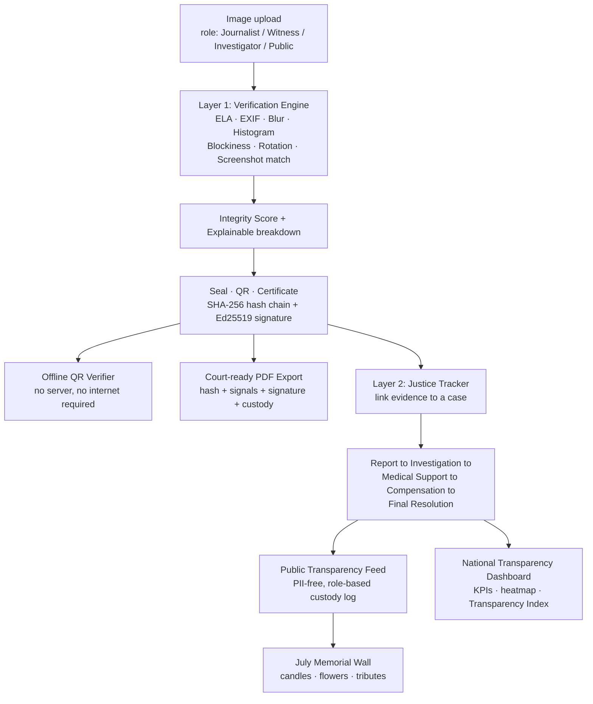

<div align="center">



**A forensic verification engine, a justice tracker, a national transparency dashboard, and a living memorial. Built for the survivors, journalists, and citizens of the July 2024 uprising, and for every movement that comes after it.**

[](#)
[](#-layer-1--সত্য-যাচাই-verification-engine)
[](#-layer-2--ন্যায়বিচার-justice-tracker)
[](#-layer-1--সত্য-যাচাই-verification-engine)
[](#)
[](https://YOUR-USERNAME.github.io/YOUR-REPO/)
[](#-license)

**[▶ Live Demo](https://drive.google.com/file/d/1hiw2udQpt2MrbmkOM2tB-p2y0IR2kPWO/view?usp=sharing) · [🎬 Pitch Page](https://drive.google.com/file/d/1h7tYCU5FEi9nHNihp_9CTriGRD0PBTyy/view?ts=6a6b90a0)**

</div>

---

## ✊ The Problem

In July 2024, Bangladesh lived through a month that changed the country. Almost immediately, the record of it became a battlefield. Photos were cropped to hide context. Injuries were staged or denied. Screenshots were doctored and re-shared as proof: especially once the internet shutdown made anything hard to check in real time. Victims' families were asked to prove their own tragedy with no tools to do so and no neutral system existed to separate a real photograph of harm from a manipulated one, or to track what happened to a case after it was reported.

**ShottoQR (সত্যQR, "Truth QR")** exists to close that gap. It is a forensic evidence pipeline that tells you how trustworthy an image is *and why*, a cryptographically sealed certificate system that can be verified with nothing but a QR code, even with no internet, a transparent case-tracking system that follows a victim's journey from report to resolution without ever exposing their identity, a national transparency dashboard that turns that same data into district-level accountability, and a living bilingual memorial so July 2024 is remembered with facts attached to it, not just feeling.

This isn't a hypothetical. It's a working system with 7 real forensic signals, a SHA-256 hash-chained seal plus a real Ed25519 digital signature, an **offline** QR verifier, one-click court-ready PDF certificates, a public transparency portal, an admin review workflow, and a role-based (never name-based) chain of custody log.

---

## 🎬 See It Live

**Pitch page:** the full bilingual, animated identity built for this project lives at **[SottoQR](https://drive.google.com/file/d/1hiw2udQpt2MrbmkOM2tB-p2y0IR2kPWO/view?usp=sharing)**, served straight from this repo's `/docs` folder via GitHub Pages. No install needed, judges can open it on a phone.


<details>
<summary><strong>How to enable the GitHub Pages link above</strong></summary>

1. Push this repo to GitHub, with `docs/index.html` included.
2. Go to **Settings → Pages** on the repo.
3. Under **Build and deployment**, set **Source: Deploy from a branch**, **Branch: main**, **Folder: /docs**. Save.
4. GitHub gives you a URL like `https://your-username.github.io/your-repo/` within a minute or two.
5. Replace every `YOUR-USERNAME.github.io/YOUR-REPO` in this README with that real URL.

Note: GitHub Pages only serves static files. It's perfect for the pitch page above, but the actual app (FastAPI + SQLite) needs a real host!

</details>

<details>
<summary><strong>How to record the demo GIF</strong></summary>

1. Run the app locally (`uvicorn app.main:app --reload`) and open `http://localhost:8000/`.
2. Screen-record a 20–40 second walkthrough: upload an image, watch the Explainable Integrity Score appear, open the certificate/QR, flip the language toggle.
   Free tools: **ScreenToGif** (Windows), **Kap** (Mac), **Peek** (Linux), or any recorder + `ffmpeg`.
3. Convert and shrink so it loads fast on GitHub:
   ```bash
   ffmpeg -i demo.mp4 -vf "fps=12,scale=800:-1:flags=lanczos" -loop 0 demo.gif
   ```
4. Save as `assets/demo.gif`. It renders automatically wherever `` appears above.

</details>

---

## 🧩 What It Does

### 🔍 Layer 1: সত্য যাচাই (Verification Engine)

* **7-signal forensic analysis.** ELA, EXIF metadata check, blur/sharpness, histogram clipping, JPEG blockiness, rotation canvas-fill detection, and screenshot resolution matching: combined into one Integrity Score with a visible, human-readable reasons list. Never a black-box fake/real verdict.
* **Explainable Integrity Score.** Every verdict opens into a signal-by-signal breakdown: each of the 7 signals shown with its own suspicion bar, a clean/suspicious/high-risk status pill, and exactly how many points it removed from the final score. A judge, a journalist, or a victim's family sees *why* a score is what it is, not just the number.
* **Reuse and duplicate detection.** Perceptual hashing (pHash) flags whether an uploaded image has circulated before, so recycled photos from other events can't be passed off as new evidence.
* **Tamper-evident sealing.** Every verified image gets a SHA-256 seal recorded in an append-only hash chain, *plus* a real Ed25519 digital signature. Break one link and the whole chain fails verification.
* **Offline-verifiable QR certificates.** A downloadable, watermarked certificate carries a QR code whose signature can be checked with nothing but the public key — no server, no database, no internet connection. This is what makes verification possible during an internet shutdown, which is exactly the condition July 2024 tested.
* **One-click court-ready PDF.** Every piece of sealed evidence can be exported as a single certificate: hash + full signal breakdown + signed manifest + offline QR + chain-of-custody table, formatted for an investigator or tribunal to file directly.
* **Chain of custody, without names.** Every action (Uploaded, Verified, Viewed, Linked to Case) is logged by role only: Journalist, Witness, Investigator, Admin, Public. Full accountability trail, zero ability to identify or endanger a source.

### ⚖️ Layer 2: ন্যায়বিচার (Justice Tracker)

* **Public transparency feed.** Every case moves through five visible stages: **Report → তদন্ত (Investigation) → চিকিৎসা (Medical Support) → ক্ষতিপূরণ (Compensation) → চূড়ান্ত সমাধান (Final Resolution)**. Anyone — a victim's family, a journalist, an oversight body: can see exactly where a case stands without asking.
* **Anonymous public reporting.** Zero identifying information required. Reports land in an admin queue as private by default, and only reach the public feed after human review.
* **Deliberate PII omission.** Victim name, NID, and phone number are not fields in the data model at all: not hidden, not encrypted, simply never collected, because that kind of data needs an access-controlled government system, not a hackathon database. `case_reference` is the only public-safe lookup identifier.
* **Admin panel.** Full case lifecycle management: create cases, update status, approve or reject public reports, link sealed evidence to a case.

### 📊 National Transparency Dashboard *(Command Center)*

* A ministry-grade, single-screen overview built entirely from the same case and evidence data above: live KPIs, a five-stage status funnel, a district heatmap, a 14-day flagged-upload trend, a live case feed, and a per-district **Transparency Index** (verification rate × resolution rate): a metric an oversight ministry could actually be held to.
* Reads live from the API. If the API or database isn't reachable, it falls back to a clearly labelled **DEMO DATA** view so a screen is never blank mid-presentation.
* Reachable at `/command-center`.

### 🕯️ জুলাই স্মৃতি (July Memorial)

* **Interactive Calendar.** A poster-style 1–36 July grid. Click any date to see what happened that day.
* **Timeline.** Drag to scroll through the full 36-day arc.
* **Verified Archive.** Searchable, filterable, sourced record of confirmed events (শহীদ, মোড়/turning point, হামলা, fall), built on citation rather than memory.
* **Digital Memorial Wall.** A dedicated space (`/memorial`) to light a candle, leave a flower, or post a moderated tribute for named and unnamed martyrs of the uprising: no photographs used, out of respect and privacy; only well-documented names are seeded, with room for families or admins to add verified profiles.
* **About Us.** The team behind it.

### 🌐 Site-wide

* **True bilingual support** (বাংলা ⇄ English), one click, everywhere: the entire interface, including the memorial, dashboard, and admin tooling.
* **Dark red, gold, and black visual identity** carried consistently from the homepage to the certificates themselves, with a faint fist watermark, so a sealed certificate is recognizably this movement's, not a generic template.
* **PWA-ready**: installable, with an offline-first service worker for low-connectivity field use.

---

## 🏆 Why This Should Win *(mapped to the judging rubric)*

Scored against the 80% that isn't audience engagement, because a project should win on what it is, not only on how hard its team can campaign for likes.

| Criterion | Weight | How ShottoQR earns it |
|---|---|---|
| **Impact & relevance to track** | 25% | Solves a documented, active problem: contested visual evidence and untracked justice claims from a real national event — for three concrete user groups. Victims and families get anonymous reporting, status visibility, and now a public transparency index. Journalists and investigators get independent, offline-capable verification, a custody trail, and a court-ready export. Government and oversight bodies get a structured case pipeline and a live public dashboard. This is a human rights and civic-infrastructure project, not a repurposed generic app. |
| **Technical execution** | 20% | Not a mockup. 7 independently implemented forensic signals with honestly reported score behaviour. A real SHA-256 hash-chain seal *and* a real Ed25519 signature, both independently verifiable offline. A FastAPI backend covering verification, case tracking, dashboard aggregation, and PDF export. Every claim in this README is something the code actually does, including what it doesn't yet do (see [Known Limitations](#-known-limitations-built-to-be-trusted-not-oversold)). |
| **Innovation & originality** | 15% | The combination is the innovation: forgery detection honestly scoped for real-world evidence photos from a civil movement, fused with a PII-free justice pipeline, an *offline-verifiable* cryptographic seal, an explainable (not black-box) integrity score, and a national transparency index most hackathon projects never attempt. |
| **Feasibility & resilience** | 10% | Runs on SQLite with no external services required. No GPU, no paid API keys — functional on a single low-end machine or a free-tier deploy (Render/Railway). Offline QR verification and a PWA shell mean the core trust mechanism survives exactly the condition that made July 2024 hard to document: an internet shutdown. |
| **Presentation & usability** | 10% | One homepage: verification, reporting, the dashboard, and the memorial all live in a single bilingual interface a non-technical judge, or a non-technical victim's family member, can use unassisted. See the [pitch page](./docs/index.html) for the full visual identity. |

---

## 🇧🇩 Path to National Adoption

This section exists because the goal was never just to win a hackathon. It's to build something the government can actually run.

* **Privacy by design, not privacy by policy.** PII fields don't exist in the schema, so there's nothing to leak, subpoena unsafely, or misconfigure.
* **Auditable by default.** Every seal, every view, every status change is logged and independently re-verifiable via QR, exactly the property an oversight ministry, a UN fact-finding mission, or an international press body needs before trusting a domestic system's output.
* **Offline-first trust.** Verification does not require the internet, the server, or even this codebase to be online, only the public key and the signed manifest. That property matters most in exactly the conditions a crisis creates.
* **Boring, resilient infrastructure.** SQLite to PostgreSQL is a one-line connection-string change when case volume demands it. The whole stack runs on commodity hardware.
* **Honest forensics.** The system tells you what it can and can't detect (see below) instead of pretending to be an infallible lie detector — the property a government or international body needs before staking legal or diplomatic weight on a verified badge.
* **Extendable to any future movement or disaster.** The July 2024 memorial and dashboard are a configuration of the architecture, not a hardcoded one-off. The same evidence-sealing, case-tracking, and transparency-index core could be repointed at any future crisis needing verifiable public record — an election, a disaster, a human rights investigation.

---

## ⚠️ Known Limitations (built to be trusted, not oversold)

Read this section out loud to the judges. It is a strength, not a weakness.

**Reliably detected:** Blur, crop, brightness/contrast change, JPEG re-compression artifacts, screenshot resolution matches, missing/stripped EXIF, perceptual-hash reuse.
**Partially detected:** Resized screenshots (exact-resolution screen dumps are caught reliably; a resized screenshot is harder). In-place rotate-and-crop edits with no canvas fill are harder to catch than rotate-and-expand edits, which do leave a detectable solid-colour corner fill.
**Not a deepfake detector.** The optional AI-image heuristic included in the court-PDF export is an experimental screen, explicitly labelled as such — it is not a definitive synthetic-image or GPU-based forgery classifier, and none is shipped, because the added GPU/deployment risk wasn't worth it for a hackathon-scale accuracy gain against a dataset the heuristic signals already cover well.

**The Integrity Score is decision support, not a verdict.** It ships with a visible, signal-by-signal reasons list so a human — a journalist, an investigator, a judge — makes the final call with evidence in front of them, not a black box.

---

## 🏗️ Architecture



**Stack:** FastAPI, SQLAlchemy, SQLite, vanilla JS/HTML/CSS frontend (bilingual I18N), Pillow forensics pipeline, PyNaCl (Ed25519), ReportLab (PDF export), `qrcode` + `jsQR` (offline scanning), PWA service worker.

GitHub renders the diagram above automatically since it's a fenced ```mermaid``` block — no image export needed.

---

## 🚀 Setup

```bash
pip install -r requirements.txt
# or: pip install -r requirements.txt --break-system-packages

# 1. Put dataset images in data/july/ (img0001.jpg ... img0030.jpg/png)
#    data/labels_fixed.xlsx is already included

python -m scripts.load_dataset     # Task 1: loads images + labels into the DB
python -m scripts.test_pipeline    # Task 2: runs all 7 forensic signals, prints score separation
python -m scripts.seal_all         # Task 3: seals every analyzed image with hash, QR, certificate

uvicorn app.main:app --reload      # Full backend + frontend + dashboard + memorial
```

Then open **`http://localhost:8000/`**. The frontend is the homepage. Raw API docs stay available at **`/docs`**, the dashboard at **`/command-center`**, and the memorial wall at **`/memorial`**.

Outputs land in `static/ela/`, `static/qr/`, `static/certificates/`, `static/exports/` (court PDFs).

> **Demoing from Colab?** Colab can't hold a persistent public URL by default. Run the app in a cell and expose port 8000 with `pyngrok`, or point judges at a Render/Railway deploy of this repo (recommended for judging — see below). Set `PUBLIC_BASE_URL` before sealing new evidence so QR codes point at the live tunnel or deployment:
> ```python
> import os
> os.environ["PUBLIC_BASE_URL"] = "https://your-ngrok-url.ngrok-free.app"
> ```
> Colab's disk wipes on disconnect, so export the database between sessions if you want to keep demo data.

## 🌍 Deploying the App

GitHub Pages only serves static files, so it's used here for the `/docs` pitch page — the actual FastAPI + SQLite app needs a real host:

1. Push this repo to GitHub (see [Team](#-team) section for the `.gitignore` note on keys).
2. On **[Render.com](https://render.com)**: New → Web Service → connect this repo.
   - Build command: `pip install -r requirements.txt`
   - Start command: `uvicorn app.main:app --host 0.0.0.0 --port $PORT`
   - Instance type: Free
3. Deploy — you get a permanent URL like `https://shottoqr.onrender.com` within a few minutes. That's your **Live Link**.

Free-tier instances sleep after ~20 minutes idle; open the link once to "warm it up" shortly before a live demo or judging session.

---

## 📡 API Reference

**Layer 1: Verification**

| Method | Endpoint | Purpose |
|---|---|---|
| `POST` | `/api/verify` | Upload jpg/png, get back Integrity Score, verdict, reasons, QR, certificate |
| `GET` | `/api/evidence` | List all sealed evidence |
| `GET` | `/api/evidence/{id}` | Single evidence record |
| `GET` | `/api/evidence/{id}/custody-log` | Full chain-of-custody timeline (JSON) |
| `GET` | `/api/verify-seal/{id}` | Independently re-verify a seal (what the QR hits) |
| `GET` | `/api/evidence/{id}/manifest` | Signed manifest for offline verification |
| `GET` | `/api/evidence/{id}/pdf` | **One-click court-ready evidence PDF** (hash, signals, signature, custody) |
| `GET` | `/api/public-key` | The Ed25519 public key used to sign every manifest |

**Layer 2: Justice Tracker**

| Method | Endpoint | Purpose |
|---|---|---|
| `POST` | `/api/cases` | Create a case (`case_reference`, `location`, `incident_summary`, `is_public`) |
| `GET` | `/api/cases` | Public transparency feed (`is_public=1` only) |
| `GET` | `/api/cases/{id}` | Case detail and linked evidence |
| `PATCH` | `/api/cases/{id}/status` | Advance status: Report → Investigation → Medical Support → Compensation → Final Resolution |
| `POST` | `/api/cases/{id}/link-evidence` | Attach sealed evidence to a case |
| `GET` | `/api/dashboard-stats` | Live aggregates powering the National Transparency Dashboard |

## 🖥️ Admin Panel

`/admin`: create and manage cases, update status, approve or reject pending public reports, link evidence. No raw API calls required for day-to-day operation.

## 📊 National Transparency Dashboard

`/command-center`: a single-screen, ministry-style view of the whole system — KPIs, case-status funnel, verdict distribution, district heatmap, flagged-upload trend, live feed, and the per-district Transparency Index. Falls back to clearly labelled demo data if the API isn't reachable, so it's never blank mid-demo.

## 🕯️ Memorial Wall

`/memorial`: light a candle, leave a flower, or post a moderated tribute for the martyrs of July 2024. Respectful by design — no photographs, only well-documented names seeded, with light client-side moderation on tributes.

## 🗂️ Project Structure

```
app/
├─ database.py         SQLAlchemy engine/session
├─ models.py            EvidenceImage + Case + CaseEvidence + CustodyLogEntry tables
├─ forensics.py          7 forensic signals + combined Integrity Score
├─ seal.py                SHA-256 seal, hash-chain ledger, QR generation, certificates
├─ crypto_signing.py       Real Ed25519 signing/verification (offline-capable)
├─ court_export.py          One-click court-ready evidence PDF generator
├─ ai_detect.py               Optional, honestly-labelled AI-image heuristic
└─ main.py                      FastAPI app — verification, justice tracker, dashboard, memorial, admin
scripts/
├─ load_dataset.py      Task 1
├─ test_pipeline.py      Task 2
├─ seal_all.py             Task 3
└─ verify_offline.py         Standalone offline verifier (no server, no internet)
static/
├─ command-center.html   National Transparency Dashboard
├─ memorial.html           July Memorial Wall
├─ js/explainscore.js       Explainable Integrity Score breakdown
├─ js/main.js                 Frontend logic + I18N + JULY archive data
└─ css/style.css                 Visual identity
templates/index.html · admin.html · verify_result.html   Bilingual frontend
docs/index.html         GitHub Pages source (pitch page, see "See It Live" above)
assets/demo.gif         Product walkthrough GIF embedded in this README
```

To add another judge-facing language (Hindi, Arabic, French, whoever is on the panel), add one key to every entry in the `I18N` object in `static/js/main.js` and a matching button in `.lang-switch` in `templates/index.html`.

---

## 👥 Team

| Name | Institution | Role | GitHub |
|---|---|---|---|
| Meherun Ritu | ULAB | Team Lead | [@Meherunritu](https://github.com/Meherunritu) |
| Tahsin Shuborna | AUST | Engineering | [@tahscene](https://github.com/tahscene) |
| Shahriar Hossain Arafat | AUST | Engineering | [@ShArafat58](https://github.com/ShArafat58) |

> Before pushing: add `keys/*.key` to `.gitignore` so the Ed25519 private key never lands in a public repo.

---

## 📜 License

MIT. Built to be forked by the next team that needs to protect the record of what actually happened.

<div align="center">

**সত্য মুছে যায় না। The truth doesn't erase.**

</div>
